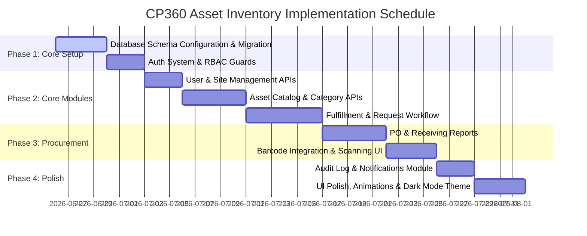

# Product Requirements Document (PRD)
## Project: CP360 Asset Inventory System

---

## 1. Document Overview
This document outlines the business, functional, and technical requirements for the **CP360 Asset Inventory System**. The application is designed to manage IT and operational assets across multiple physical sites of ContactPoint 360, tracking their entire lifecycle from purchase orders and receiving to requests, assignments, maintenance, and retirement.

---

## 2. System Architecture & Tech Stack

The system is built as a modern, full-stack web application designed for high performance, ease of deployment, and a premium user experience.

- **Frontend**: Next.js 16 (App Router) with React 19, TailwindCSS v4, and custom components designed around CP360 brand guidelines (Royal Blue/Sky Blue gradient gradients, clean slate/slate-900 typography, glassmorphism, responsive navigation).
- **Backend**: NestJS (TypeScript Node.js framework) providing a structured, modular REST API.
- **Database**: PostgreSQL managed via Prisma ORM.
- **Deployment/Containerization**: Docker & Docker Compose orchestrating the database services.

---

## 3. User Personas & Role-Based Access Control (RBAC)

Data scoping and system permissions are strictly governed by the following roles:

| Role | System Name | Scoping | Key Permissions |
| :--- | :--- | :--- | :--- |
| **Super Admin** | `SUPER_ADMIN` | Global (All Sites) | Full system control. Can create/modify sites, manage users across all locations, customize settings, view global audit logs. |
| **Ops Manager (Admin)**| `ADMIN` | Site-scoped | Full control over the inventory, suppliers, categories, POs, requests, and access to Reports & Logs within their assigned site. Cannot manage other sites' data. |
| **Inventory Staff** | `INVENTORY_STAFF` | Site-scoped | Can manage physical stock levels, assign/release items, scan/process barcodes, log conditions, process returns, and access Reports & Logs. |
| **Team Leader** | `TEAM_LEADER` | Site-scoped | Can request assets on behalf of team members, approve employee-level requests, and track team-assigned items. |
| **Employee** | `EMPLOYEE` | Site-scoped | Standard request access. Can view their assigned assets, request new items, and cancel their own pending requests. |

---

## 4. Database Schema and Entity Relationships

The data model is implemented in PostgreSQL via Prisma. Below is the mapping of functional requirements to schema models:

```mermaid
erDiagram
    Site ||--o{ User : contains
    Site ||--o{ Asset : contains
    Site ||--o{ SiteStock : tracks
    Site ||--o{ PurchaseOrder : creates
    Site ||--o{ ReceivingReport : logs
    
    User ||--o{ Request : requests
    User ||--o{ Request : approves
    User ||--o{ Request : releases
    User ||--o{ Request : returns
    User ||--o{ PurchaseOrder : creates
    User ||--o{ ReceivingReport : receives
    User ||--o{ Asset : assigned-to
    User ||--o{ AuditLog : performs
    User ||--o{ Notification : receives

    AssetCategory ||--o{ Item : groups
    Item ||--o{ SiteStock : has-levels
    Item ||--o{ Asset : templates
    Item ||--o{ PurchaseOrderItem : ordered-in
    Item ||--o{ Request : requested-in

    Supplier ||--o{ PurchaseOrder : supplies
    PurchaseOrder ||--o{ PurchaseOrderItem : includes
    PurchaseOrder ||--o{ ReceivingReport : triggers
    
    Request ||--o? Asset : fulfills
```

### Key Models Explained:
1. **`Site`**: Stores physical office locations (e.g., Cebu IT Park, Toronto HQ). Each site has a unique short `prefix` (e.g., "CEB", "TOR") used for auto-generating asset tags.
2. **`User`**: System identities with encrypted password hashes, emails, active statuses, and assigned sites (except global Super Admins).
3. **`AssetCategory`**: Groups items into types (e.g., "Laptops", "Peripherals"). Specifies `CategoryType` as:
   - **`CONSUMABLE`**: Checked out and consumed (e.g., pens, batteries, cables). No serialized tracking.
   - **`NON_CONSUMABLE`**: Serialized and tracked individually (e.g., laptops, monitors, headsets).
4. **`Item`**: The catalog blueprint of an asset (e.g., "MacBook Pro 14\" M3"). Contains SKU, price, and default supplier lead time.
5. **`SiteStock`**: Tracks the quantity of each catalog `Item` physically available at a specific `Site`. Defines a `reorderPoint` to trigger alerts when stock runs low.
6. **`Asset`**: The physical, serialized instance of a `NON_CONSUMABLE` item. Includes `serialNumber`, a unique barcode, an auto-generated asset tag code (e.g., `CEB-CON-0042`), its physical condition (e.g., "Good", "Damaged"), and assignment records.
7. **`PurchaseOrder` (PO) & `PurchaseOrderItem`**: Tracks supply orders placed with `Suppliers` for specific items, quantities, and unit costs.
8. **`ReceivingReport` (RR)**: Generated when a PO is delivered. Attaches invoices and records who processed the delivery at the site.
9. **`Request`**: Orchestrates the checkout workflow. Links a requester, an item, an approver, and the inventory staff responsible for release and return.

---

## 5. Functional Requirements by Module

### 5.1 Authentication & Workspace Scoping
- **Login Portal**: Secure email/password login. Includes a fallback demo flow.
- **Session Scoping**: Once logged in, all operations, dashboard panels, and lists must automatically filter based on the user's assigned `siteId`.
- **Primary Administrator Safeguard**: The default Super Admin account cannot be deactivated or deleted to prevent accidental system lockout.

### 5.2 User Management
- **Dashboard Interface**: Interactive grid displaying user details, departments, and active statuses. Includes filters by role and search query (name, email, or employee ID).
- **Administration Actions**: Admins can invite/add new users, edit profile details, change roles, and toggle user active states.

### 5.3 Asset Catalog & Category Management
- **Category Configuration**: Create categories with custom prefix configurations (e.g., `LAP` for Laptops) and mark them as consumable or non-consumable.
- **Catalog Management**: Add generic items/SKUs to categories. Define pricing and estimated lead times.
- **Stock Tracking**: Maintain live tallies of quantities per site. If a quantity falls at or below the `reorderPoint`, flag it in the system.

### 5.4 Physical Asset Inventory (Serialized Tracking)
- **Asset Registration**: Register specific physical items with unique serial numbers.
- **Asset Tag Auto-Generation**: Tag codes are automatically constructed based on the structure:
  `[Site Prefix]-[Category Prefix]-[Sequential Number]` (e.g., `CEB-LAP-0231` for Cebu site, Laptop category, item 231).
- **Condition Logs**: Track wear-and-tear conditions (e.g., "NEW", "GOOD", "FAIR", "DAMAGED").
- **Status Lifecycle**: Manage asset states through the `AssetStatus` lifecycle:
  - `AVAILABLE` -> Ready for checkout.
  - `ASSIGNED` -> Allocated to an employee.
  - `UNDER_MAINTENANCE` -> Out for repairs.
  - `RETIRED` -> Reached end of life.

### 5.5 Requests & Checkout Workflow
- **Submission**: An `EMPLOYEE` or `TEAM_LEADER` requests a specific `Item` from the catalog, detailing the purpose.
- **Approval routing**: 
  - Requests submitted by an `EMPLOYEE` require approval from their `TEAM_LEADER` or the site `ADMIN`.
  - Requests submitted by a `TEAM_LEADER` are routed to the site `ADMIN` for approval.
- **Release (Fulfillment)**: Once approved, `INVENTORY_STAFF` fulfills the request by selecting a specific physical `Asset` (which changes status to `ASSIGNED` and assigns `assignedToId` to the employee) or deducting stock for consumables.
- **Return (Check-in)**: For non-consumables, upon return, `INVENTORY_STAFF` inspects the asset, logs its condition, sets the asset back to `AVAILABLE`, and records the return timestamp.

### 5.6 Purchase Orders & Receiving
- **Procurement Planning**: Create POs in `DRAFT` status, adding items, quantities, and negotiated costs.
- **Order Placement**: Progress POs to `ORDERED`.
- **Receiving & Auditing**:
  - Upon arrival, staff verify counts, moving the status to `PARTIALLY_RECEIVED` or `RECEIVED`.
  - An associated `ReceivingReport` is generated. Staff can upload/attach an invoice file and input invoice and delivery reference numbers.
  - Incoming item quantities are automatically added to the active `SiteStock` balance.

### 5.7 Notifications & Alerts
- **Low Stock Warnings**: Automatically dispatch alerts when a consumable or catalog item drops below its defined threshold.
- **Workflow Alerts**: Notify Team Leaders of pending approvals, and Employees when their items are approved/ready for collection.

### 5.8 Reports & Audit Logs
- **Activity Logging**: Track all mutations (user creations, asset releases, inventory adjustments) in an immutable `AuditLog` table containing user, action, details, timestamp, and client IP addresses.
- **Analytics Reports**: Dashboard indicators showing:
  - Total asset value grouped by site/category.
  - Percentage of assets currently assigned vs. in repair/retired.
  - Impending out-of-stock items.

---

## 6. Development & Implementation Roadmap

The implementation is planned in distinct phases:



---

## 7. Quality Assurance & Verification
- **Unit & Integration Testing**: NestJS controllers and services validated using Jest (located in the `backend/test` directory).
- **Fulfillment Assertions**: Database constraints must enforce that an asset cannot be assigned to more than one user at a time, and a user cannot checkout more assets than available in stock.
- **E2E Visual Checks**: Verify UI responsiveness across standard desktop, tablet, and mobile dimensions.
